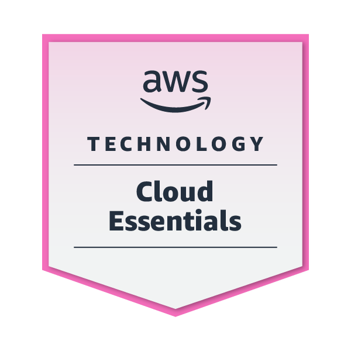
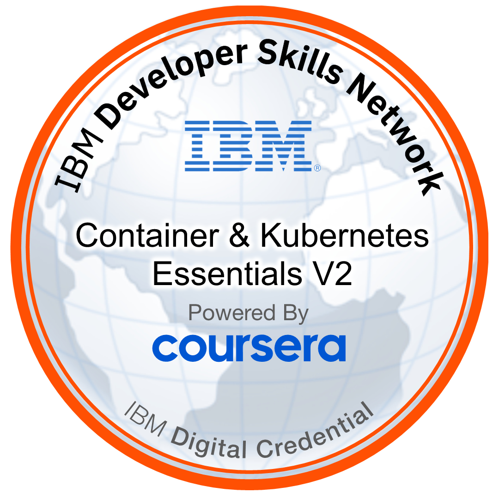

<h2>Hello World 🌎 I'm Rashitha🧔 (aka Don)</h2> 
  

   🔭 I’m currently working on my research and final year project 
  🌱 Enthusiastic about learning DevOps practices  
  📫 How to reach me: Linkedin "Rashitha Alahakoon"  
   😄 Pronouns: Don 
   ⚡ Fun fact: Roses are red and violet are blue but I can't rhyme😠
  

 

&nbsp;

  

<h3>Languages and frameworks</h3>

  

<h3> DevOps Stuff</h3>

  

  
<!--START_SECTION:badges-->
<!--END_SECTION:badges-->
<h3>Awards and certifications</h3>

  
  

<h3 align="left">Connect with me:</h3>

<!-- Page views -->

  

